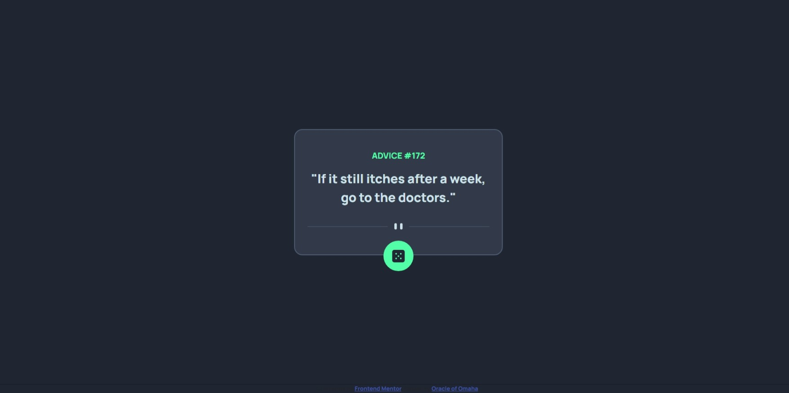

# Frontend Mentor - Advice generator app solution

This is a solution to the [Advice generator app challenge on Frontend Mentor](https://www.frontendmentor.io/challenges/advice-generator-app-QdUG-13db). Frontend Mentor challenges help you improve your coding skills by building realistic projects.

## Table of contents

- [Overview](#overview)
  - [The challenge](#the-challenge)
  - [Screenshot](#screenshot)
  - [Links](#links)
- [My process](#my-process)
  - [Built with](#built-with)
  - [What I learned](#what-i-learned)
  - [Continued development](#continued-development)
  - [Useful resources](#useful-resources)
- [Author](#author)
- [Acknowledgments](#acknowledgments)

## Overview

### The challenge

Users should be able to:

- View the optimal layout for the app depending on their device's screen size
- See hover states for all interactive elements on the page
- Generate a new piece of advice by clicking the dice icon

### Screenshot



### Links

- Solution URL: [https://github.com/Rodney-Mokenyu/advice-generator-app](https://github.com/Rodney-Mokenyu/advice-generator-app-main/)
- Live Site URL: [https://rodney-mokenyu.github.io/advice-generator-app/](https://rodney-mokenyu.github.io/advice-generator-app-main/)

## My process

### Built with

-   Semantic HTML5 markup
-   CSS custom properties
-   Flexbox
-   Mobile-first workflow
-   Vanilla JavaScript
-   [Advice Slip API](https://api.adviceslip.com/) for fetching advice

### What I learned

This project was a great opportunity to practice fetching data from an external API and dynamically updating the UI. Here are some of my key learnings:

-   **Asynchronous JavaScript with Fetch API:** I learned how to use `async/await` with the `fetch` API to retrieve data from `https://api.adviceslip.com/advice`. Implementing `cache: 'no-cache'` was important to ensure a new piece of advice is generated with each click.

    ```js
    async function fetchAdvice() {
        try {
            const response = await fetch('[https://api.adviceslip.com/advice](https://api.adviceslip.com/advice)', { cache: 'no-cache' });
            if (!response.ok) {
                throw new Error('Network response was not ok');
            }
            const data = await response.json();
            adviceID.textContent = `${data.slip.id}`;
            adviceText.textContent = `"${data.slip.advice}"`;
        } catch (error) {
            console.error('There has been a problem with your fetch operation:', error);
        }
    }
    ```

-   **Dynamic Content Update:** I gained experience in efficiently selecting and updating specific DOM elements (`advice-id`, `advice-text`) with the fetched data, ensuring the UI reflects the latest advice.

-   **Event Handling:** Attaching an event listener to the dice button was straightforward, allowing the `fetchAdvice` function to be triggered on user interaction.

-   **Responsive Layout with CSS Flexbox & Sizing:** I used Flexbox (`display: flex`, `justify-content-center`, `align-items-center`, `min-vh-100`) to center the main card on the page. For responsive sizing of the card itself, `inline-size: min(90vw, 400px);` was effective in keeping the card fluid on smaller screens while limiting its maximum width on larger ones.

    ```css
    .card-box {
        inline-size: min(90vw, 400px); /* Responsive width with max limit */
        position: relative; /* For positioning the dice button */
    }
    ```

-   **CSS Absolute Positioning for UI Elements:** Positioning the dice button precisely at the bottom center of the card involved using `position: absolute`, `bottom`, `left: 50%`, and `transform: translateX(-50%)`.

    ```css
    #dice-button {
        position: absolute;
        bottom: -2rem; /* Example offset from the bottom */
        left: 50%;
        transform: translateX(-50%); /* Centering trick */
    }
    ```

-   **Hover States:** Basic hover effects were applied to the dice button, providing visual feedback to the user on interaction.

    ```css
    #dice-button:hover {
        background-color: hsl(150, 100%, 76%); /* Lighter shade on hover */
        box-shadow: 0 0 0.625rem hsl(150, 100%, 76%); /* Glow effect */
    }
    ```

### Continued development

In future projects, I would like to continue focusing on:

-   **Loading States:** Implementing a visual loading indicator (e.g., a spinner or text) while the advice is being fetched from the API to provide better user feedback during network delays.
-   **Enhanced Error Handling UI:** Instead of just logging errors to the console, I aim to display more user-friendly error messages directly on the UI if the API call fails or returns unexpected data.
-   **Accessibility Improvements:** Further enhancing accessibility, particularly for dynamic content updates, to ensure screen readers are properly informed when new advice is displayed.
-   **CSS Transitions and Animations:** Exploring more subtle and engaging CSS transitions or animations for elements beyond basic hover states, possibly when new advice loads.

### Useful resources

-   [Advice Slip API Documentation](https://api.adviceslip.com/) - This was the core resource for understanding how to request and parse the advice data.
-   [MDN Web Docs - Fetch API](https://developer.mozilla.org/en-US/docs/Web/API/Fetch_API) - My go-to for syntax and understanding of `fetch` and `async/await`.
-   [CSS-Tricks - A Complete Guide to Flexbox](https://css-tricks.com/snippets/css/a-guide-to-flexbox/) - A valuable reference for mastering Flexbox layouts and centering techniques.

## Author


-   Frontend Mentor - [@Rodney-Mokenyu](https://www.frontendmentor.io/profile/Rodney-Mokenyu)


## Acknowledgments

This project was a fantastic challenge provided by Frontend Mentor. It allowed me to solidify my understanding of consuming APIs with vanilla JavaScript and crafting responsive layouts.